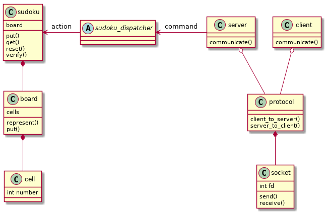
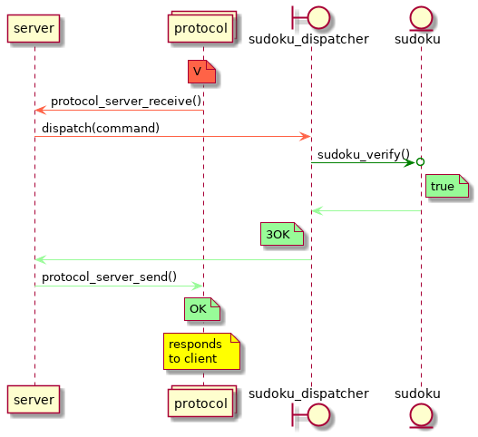

En el ejercicio se implementa un programa que actua por un lado como cliente y por el otro como servidor. El rol del servidor será el almacenar y accionar sobre un juego de sudoku, del cual el cliente le dirá que comandos seguir.

En el presente informe se muestran los rasgos generales del programa desarrollado, su esqueleto y algunos problemas encontrados en el desarrollo, y su subsiguiente solución.

## Diseño

El trabajo se dividió en dos modulos (casi) enteramente separados. Por un lado, esta todo lo que se refiere al juego de sudoku en sí, que puede ser jugado localmente sin necesidad de ningún tipo de conectividad, y por el otro, esta el componente de red, el cual se encarga de enviar los comandos desde el jugador hasta el juego.

La conexión entre estos módulos es mínima (solo una clase que se encarga de 'despachar' los comandos). De ser deseado, con pocos cambios se podría jugar a otro juego (un crucigrama) con el mismo tipo de conexión, o inversamente, podría usarse otro tipo de conexión (en vez de sockets, una RESTful API) para jugar al sudoku.

Ambos modulos fueron diseñados con un sistema de capas en mente, con cada capa siendo compuesta por una en un nivel inferior. El sudoku contiene al tablero que contiene a las celdas con los números, y el servidor/cliente contiene al protocolo que contiene al socket de comunicación.

{ width=440px }

Si bien este diagrama no esta detallado a nivel implementación (por ejemplo, el protocolo discretiza entre envíar y recibir), es una vista general acerca del diseño del trabajo y los distintos roles y responsabilidades de las clases.

## Comunicación

En cuanto a la comunicación entre servidor y cliente, hay también diversas capas. Es por este diseño modular que uno podría reemplazar los distintos componentes y los niveles no llegarían a enterarse del cambio. 

Por ejemplo, el protocolo actual es el de convertir un comando como `put 5 in 1,2` en un mensaje como `P512`, y que eso se despache a la acción de colocar un número en una celda. Sin embargo, este protocolo podría cambiarse a que sea el mensaje `P125`, y solo debería cambiarse la capa del medio (el protocolo), sin que el servidor y el cliente se vean modificados.

De misma manera, se podría reemplazar el socket por una API, y el servidor y el cliente no verían cambios desde su lado (estos no tienen ni noción de lo que hay por debajo del protocolo, solo se encargan de pedir comandos y dar respuestas).

Punto de vista del cliente/servidor | 
- | -
{ width=250 } | { width=350px }

Es de notar que en ninguno de estos dos diagramas (desde el punto de vista del cliente y del servidor respectivamente) se habla de sockets. A estos participantes no les concierne lo que haya debajo del protocolo.

## Problemas particulares

En el desarrollo del programa, se encontraron varios problemas. Algunos, los más interesantes, se detallan a continuación.

### Sudoku

**Representación del tablero**

Siendo tan engorrosa la manera en la que se tiene que imprimir el tablero por pantalla, se termino optando por una concatenación de funciones que sepan como imprimir distintas partes del tablero, y todas estas representaciones siendo concatenadas en el mismo buffer.

Primero, se llama a imprimir al tablero, el cual llama a la impresión de cada linea (es decir itera todas las lineas). Esta impresión de linea llama 3 veces a la impresión de cada conjunto de 3 celdas (una linea es de 9 celdas, entonces se llama a 3 impresiones de 3 celdas). Finalmente, esta impresión de celdas llama a la impresión de cada celda singular. Entonces, primero se imprimen las 3 celdas del conjunto, a este se le concatenan las celdas 4 a 6 y luego 7 a 9, y ya se tiene la primera fila, y luego se repite este proceso por cada fila.

**Verificación del tablero**

Sabiendo que las reglas del sudoku se prestan a la generalización, se intento hacer una función auxiliar que verifique el estado tanto de las filas como de las columnas como de las secciones de 9 celdas. Entonces, se tiene una función que verifica que en un conjunto de 9 celdas, sea cuales fueren, no se repitan números. Esto se hace sencillamente inicializando una lista de booleanos donde el índice representa que el número este presente, una vez que se repite un booleano, se sabe que el número ya estaba presente y por ende el conjunto no es valido.

Para las filas y las columnas el conjunto a verificar es facíl: se iteran todas las celdas con indice `x,y`, con el `x` fijo en el caso de verificar una fila, y con el `y` fijo al verificar una columna.

Para las secciones, en cambio, se iteran 3 filas partiendo desde la división entera (`//`) del número de sección (yendo de izquierda a derecha y de arriba a abajo) con el 3, y 3 columnas partiendo desde el resto (`%`) de la división. Por ejemplo, para la sección 0 (arriba a la izquierda del tablero), se iteran las filas 0 1 y 2 (siendo `0//3 == 0`) y las columnas 0 1 y 2 (`0%3 == 0`). 

### Red

El mayor problema encontrado en el diseño de las conexiones fue al agregarle comportamiento de validación al cliente. Al ingresar un número invalido (por ejemplo, un 0), según las especificaciones del trabajo, es el cliente quien debe imprimir un mensaje de error y nunca se debe enviar nada al servidor.

El problema con esto es que intenta romper mucho del encapsulamiento previamente planteado. Idealmente, el cliente solo debería encargarse de imprimir lo que el servidor le responda, sea lo que sea, y es por esto que debería poder codificarse como un módulo externo al servidor (quien sí debe conocer del juego), y funcionar solamente como un cliente que se conecta.

En cambio, con esta nueva funcionalidad de validar los comandos, el cliente pasa a tener conocimiento del modelo detrás, ahora el cliente debe saber específicamente que lo que hay del otro lado de la conexión es un *sudoku*, y tiene que saber las reglas del juego como para saber que comando es valido y que comando no.

Es por esto que la clase que despacha comandos pasa a funcionar tanto para el cliente como para el servidor. Idealmente, de ser más grande el proyecto, este *handler* debería dividirse en dos, uno del cliente y uno del servidor. Pero como el cliente solo se encarga de imprimir lo que recibe (comportamiento no tan digno de una clase entera, porque es solo una llamada a `printf()`), y de validar comandos, se deja al `sudoku_dispatcher` con dos funciones, una que llame el cliente y una que llame al servidor, y no como dos clases distintas.