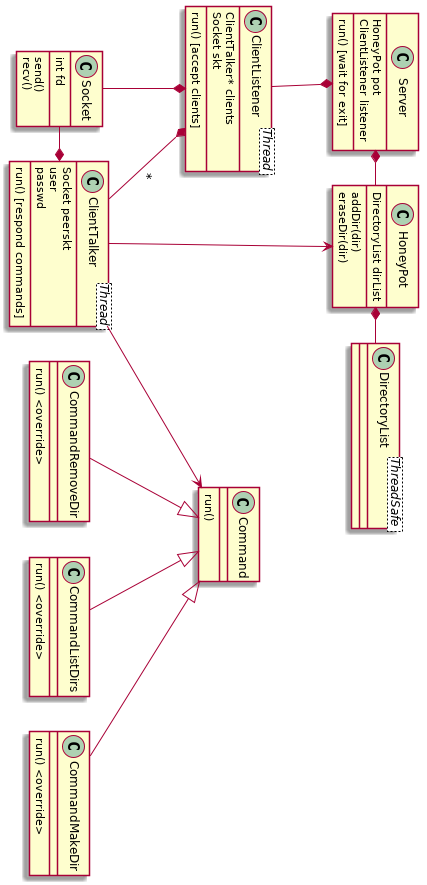

En el ejercicio se implementa un servidor que funciona como un *HoneyPot* que sigue con el protocolo FTP. Así, cuando un cliente se quiere conectar y hacer algunas acciones comunes (crear y borrar directorios, por ejemplo), desde su punto de vista *creerá* que las acciones se están ejecutando como un servidor normal, cuando en realidad el *Pot* solo dirá que así lo hizo.

Así, se usa como un intermediario entre lo que un posible cliente haría sobre el servidor, y el servidor en sí, para entender que comandos utilizará, de que maneras podría llegar a intentar vulnerabilizar al sistema, y demás.

## Diseño

El trabajo se divide en dos partes distintas. Por un lado, el programa del lado del cliente, y por el otro, el del servidor. Estos dos módulos, más alla de reutilizar código en común (el protocolo, y el sistema de comunicación, que en este caso es a través de sockets TCP), estan separados enteramente, haciendo que la conexión sea toda a traves de la red.

Algo relevante del desarrollo es que se optó por utilizar al protocolo de comunicación como una biblioteca de funciones, ya que su unica función es transcribir mensajes. Es por esto, que en vez de tener una *clase* Protocolo, se tiene un *namespace* protocolo, con solamente los llamados a enviar y recibir mensajes siguiendo las reglas de comunicación establecida. Así, como si fuese una clase con todas funciones estáticas, se puede llamar tanto desde el servidor como desde el cliente, y no es algo instanciable. Es por no ser una clase que se lo excluye del diagrama de clases del proyecto.

La porción del cliente es sumamente sencilla, y tiene solamente la clase del Cliente en sí, cuya única responsabilidad es recibir texto por entrada estandar y enviarlo al puerto que se haya especificado, y lo que respecta a la comunicación (el *namespace* del protocolo, y la clase de Socket). En cambio, la parte del servidor es mucho más compleja, y se detalla a continuación.

### Servidor

El servidor presenta más dificultad que el cliente por tener que recibir a multiples clientes en solo una ejecución. Para lograr esto, se hace uso de *multithreading*, creando un nuevo hilo por cada cliente a atender, además del hilo dedicado a aceptar conexiones entrantes (y nunca olvidando al hilo principal, el que parte de *main* y es quien instancia a la clase Servidor).

Comenzando la ejecución, se tiene al hilo principal, quien instancia al servidor. El servidor se compone de un escuchador/aceptador de clientes, que es un hilo aparte. Mientras el primer hilo se queda esperando a que se escriba algo por entrada estandar (con el caracter 'q' se le dice al servidor de cerrar todo y finalizar la ejecución), el escuchador aceptara conexiones entrantes.

El escuchador, por su parte, se compone de un vector de los distintos clientes aceptados. Estando constantemente escuchando, cada vez que se recibe una conexión nueva, se instancia un hilo nuevo para el cliente, que será el hablador con clientes, y este hilo se agrega al vector.

Finalmente, los múltiples hilos de habladores con clientes serán los encargados de recibir los comandos que nos envio el cliente desde su programa, procesarlos (es decir, aplicarlos sobre el *HoneyPot*), y devolver una respuesta, al mismo puerto por el cual se recibio el comando.

\newpage
\fancyfoot[]{}

## Cambios requeridos en la re-entrega

* Pasa a usar referencias para todos los parámetros de tipo `std::string`.

* Simplifica el constructor de `Client` a una única linea que llama a `connect` sobre `this->socket`.

* Pasa al stack los atributos de usuario/contraseña y el de si el hilo esta vivo o no de `ClientTalker` (así, evita usar punteros).
